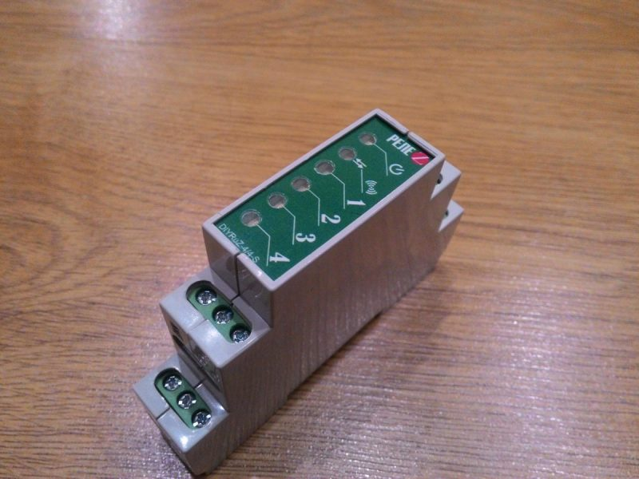

DIY устройства
===

Кейпад на 20 кнопок
---

[https://modkam.ru/?p=1114](https://modkam.ru/?p=1114)

4х канальное реле и бузер
---

[https://modkam.ru/?p=1054](https://modkam.ru/?p=1054)

4х канальное реле на 1DIN
---

[https://modkam.ru/?p=939](https://modkam.ru/?p=939)

Универсальный модуль Zigbee
---

[https://modkam.ru/?p=1220](https://modkam.ru/?p=1220)

Универсальное устройство ZigUP
---

[https://github.com/formtapez/ZigUP](https://github.com/formtapez/ZigUP)
